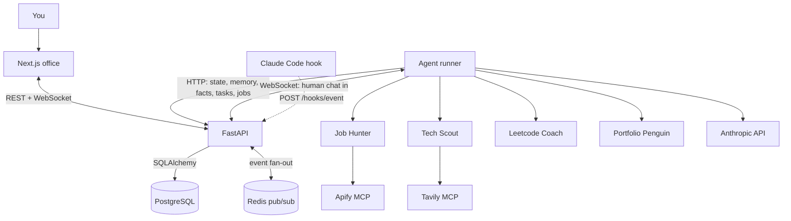
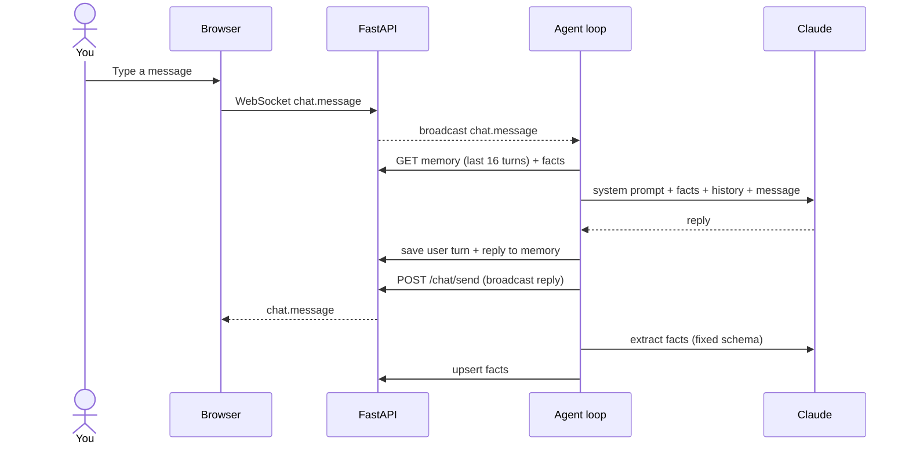
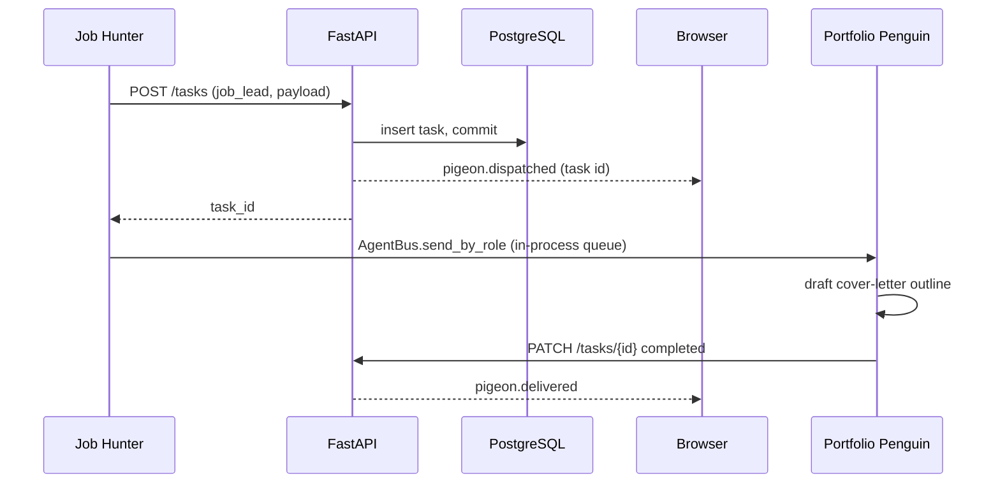

# PenguinHQ architecture

PenguinHQ has a Next.js frontend, a FastAPI service, and one Python agent-runner process, backed by PostgreSQL and Redis. Everything in this document describes the code in this repository.

## System overview

| Component | Responsibility |
| --- | --- |
| `web` | Office renderer, chat sidebar, practice desk |
| `api` | Validation, persistence, service-token checks, WebSocket fan-out |
| `agent-runner` | Runs the four agent loops; no inbound port |
| `postgres` | Agents, memory, facts, tasks, job listings, practice sessions |
| `redis` | Pub/sub so events reach sockets on any API process |

The runner never connects to PostgreSQL. All reads and writes go through the API over HTTP with a bearer service token.

## The agent loop

`AgentRuntime` waits for the API, loads the agent records, builds the matching `BaseAgent` subclass for each role, and starts one `asyncio` task per agent. All agents share one `httpx` client, one `AsyncAnthropic` client and one in-process `AgentBus`.

Each agent's `run()` loop works in a fixed priority order:

1. **Human chat message**, received by the agent's own WebSocket listener and queued.
2. **Task from another agent**, from its inbox on the bus.
3. **Its own autonomous cycle**, once `cycle_seconds` passes with nothing else to do. It checks the queues every 5 seconds while waiting, so a new message cuts the wait short.

An exception inside a cycle is logged, the agent sleeps 10 seconds, and the loop continues. One agent failing does not stop the others.

The chat listener only reacts to **humans**. It skips its own echoes and any message whose author is a registered agent; without that check, agents would reply to each other forever. Messages in `#human` that start with `@role` wake only that agent.

| Agent | Role | Channel | Cycle |
| --- | --- | --- | --- |
| Job Hunter | `job_hunter` | `jobs` | 180 s |
| Tech Scout | `tech_scout` | `research` | 86,400 s |
| Leetcode Coach | `leetcode_coach` | `leetcode` | 86,400 s |
| Portfolio Penguin | `portfolio` | `jobs` | 300 s |

## Answering a message

Fact extraction runs **after** the reply is posted, so you don't wait for the second model call.

## Memory

| Layer | Storage | Used for |
| --- | --- | --- |
| Conversation | `agent_memory`: user/assistant turns per agent | The last `memory_limit` (16) turns become the message history |
| Facts | `agent_facts`: key/value per agent, upserted | Added to the system prompt on every reply |

Each agent declares a fixed `fact_schema`. Job Hunter's, for example, is `candidate_name`, `target_role`, `target_location`, `experience_level`, `key_skills`, `salary_expectation` and `job_preferences`. The extractor may only output those keys, and is told to leave a field out rather than guess. With a fixed schema the same fact always overwrites the same row, and extraction can be tested.

Keys starting with `_` are internal counters, such as `_job_hunter_daily_quota`. They live in the same table but are kept out of prompts.

## Tools over MCP

Job Hunter and Tech Scout each open a session against a hosted MCP server using the official `mcp` Python client over streamable HTTP:

- **Job Hunter → Apify.** It finds the LinkedIn Jobs actor's tool by name, runs it, then reads the actor's dataset. Results are normalised, filtered by experience, de-duplicated, and saved through `POST /jobs/ingest`.
- **Tech Scout → Tavily.** It finds the search tool, sets `search_depth=basic` where the schema allows, and never uses crawl, map or research tools.

`ask_llm(web_search=True)` can also grant Anthropic's hosted `web_search` tool. That runs server-side, so no client tool loop is needed.

### Budgets

| Agent | Limit | Default | Stored in |
| --- | --- | --- | --- |
| Job Hunter | Listings per day | 10 (`JOB_HUNTER_DAILY_LIMIT`) | `agent_facts` |
| Tech Scout | Tavily credits per day | 3 (`TECH_SCOUT_DAILY_TAVILY_CREDIT_LIMIT`) | `agent_facts` |

Counts are keyed by date and kept in the database, so restarting doesn't reset them. When a limit is hit the agent says so once and pauses until the next day. These are safeguards, not billing caps; keep provider-side limits on too.

### Errors

- A missing provider key turns off only that tool.
- Model errors are turned into short chat messages (credit balance, auth, rate limit, other) without raw exception text.
- Apify tokens are redacted from tool error messages before they are logged or shown.

## Hand-offs between agents

The task row is committed **before** the pigeon animation is broadcast, so a pigeon on screen always matches a saved task.

Delivery itself goes through an in-process `asyncio.Queue`. If the runner restarts while a task is in flight, the row stays `pending` but nothing re-delivers it. Delivering from the database with leases and retries is the planned fix.

## API and events

| Area | Endpoints |
| --- | --- |
| Health | `GET /health`, `GET /health/ready` (checks PostgreSQL, reports Redis) |
| Agents | `GET /agents`, `POST /agents/{id}/state` |
| Memory | `GET`/`POST /agents/{id}/memory`, `GET`/`POST /agents/{id}/facts` |
| Chat | `POST /chat/send` |
| Tasks | `POST /tasks`, `GET /tasks`, `PATCH /tasks/{id}` |
| Jobs | `POST /jobs/ingest`, `GET /jobs` |
| Practice | `/practice/sessions`, drafts, attempts, feedback |
| Coding hook | `POST /hooks/event` |
| Live updates | `/ws/{client_id}` |

WebSocket envelopes have `type`, `payload` and `timestamp`. The main events are `connection.ack`, `chat.message`, `agent.state_changed`, `pigeon.dispatched` and `pigeon.delivered`. They are defined in Pydantic (`domain/schemas/events.py`) and mirrored by hand in `packages/shared-types`.

Each API process holds its own sockets. Redis pub/sub carries every broadcast to all API processes, which forward it to their local clients.

**Authentication.** When `PENGUINHQ_API_TOKEN` is set, HTTP routes need `Authorization: Bearer <token>` and WebSocket publishers need the token as `access_token`. Comparison uses `secrets.compare_digest`. CORS origins are configurable. This is a single-user service token, not user accounts.

## Frontend

- Next.js App Router, with Zustand for client state.
- `useWebSocket` turns events into roster, chat, speech-bubble and pigeon updates.
- The office is DOM/CSS. Agent work state comes from the backend; walking, furniture interactions and idle routines are cosmetic and run in the browser.
- `NEXT_PUBLIC_DEMO_MODE=true` builds a read-only version with sample data and no network writes.

## Claude Code hook

`hooks/agent-tracker.sh` posts Claude Code tool events to `/hooks/event`. The API maps edits to *coding*, shell commands to *debugging* and searches to *researching*, then broadcasts the state change so a penguin mirrors your coding session. The script uses a short timeout so an unreachable API never blocks Claude Code.

## Known limitations

- Hand-offs are delivered in memory (see above).
- Chat messages are broadcast, not stored; only each agent's memory is saved.
- No evals yet for fit scoring, fact extraction or the coach's no-spoiler rule.
- No request tracing or token and cost accounting.
- Single shared service token; no per-user isolation.
- Job Hunter's "already seen" set is in memory and resets on restart.
- Event types are synchronised between Python and TypeScript by hand.
