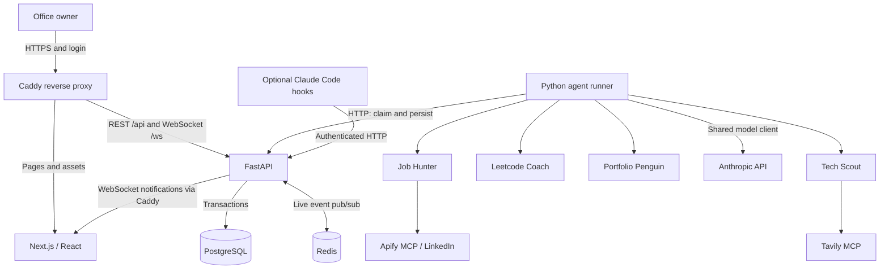
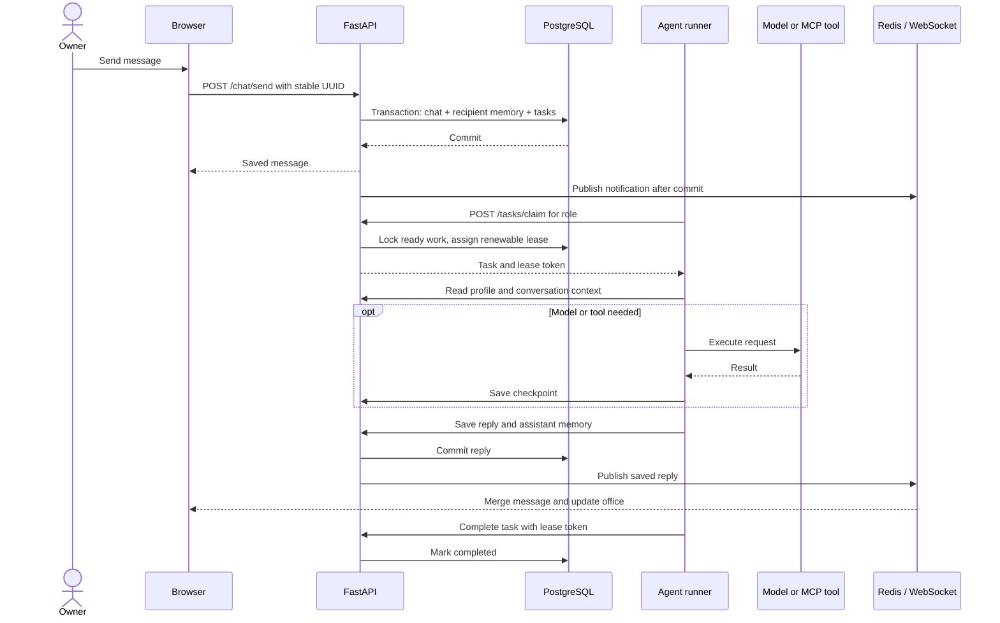

# PenguinHQ architecture

This reference describes the authenticated live runtime shown in the [README demonstrations](README.md#demo). The public portfolio is a read-only frontend using demo data. The latest private-runtime application changes are awaiting source publication; see [publication status](README.md) before assuming a published checkout matches every component below.

PenguinHQ runs a Next.js browser application, a FastAPI service, and one Python agent-runner process. PostgreSQL owns durable state and queued work. Redis carries notifications. The office animation projects agent activity; it is not the execution engine.

## System overview

The worker does **not** connect directly to PostgreSQL or consume a Redis work queue. It polls HTTP task endpoints, and the API performs the database transactions. Workers also do not depend on WebSocket subscriptions for task delivery.

| Component | Responsibility | Live network exposure |
| --- | --- | --- |
| `caddy` | TLS, office login, reverse proxy, server-side service-token injection | HTTP/HTTPS |
| `web` | Office, chat, profile editor, and practice desk | Internal port 3000, behind Caddy |
| `api` | Authentication, validation, persistence, work ownership, event fan-out | Internal port 8000, behind Caddy |
| `agent-runner` | Execute queued work for four agent roles | No inbound port |
| `postgres` | Messages, memory, profile, listings, practice, tasks, checkpoints | Internal port 5432, persistent volume |
| `redis` | Cross-process live notifications | Internal port 6379 |

The API and worker use the same Python image with separate commands and lifecycles. Development Compose publishes local service ports and mounts source files; it is a different exposure model from the private live deployment.

## A request from message to reply

A successful message response means the chat and its recipient deliveries committed together. Retrying the same UUID cannot create another delivery; reusing it with a conflicting payload returns HTTP 409. A legacy WebSocket chat-send path uses the same persistence function, but HTTP is the primary browser send path.

Notifications can be missed. The browser merges messages by ID and reloads history on reconnection and periodically, so Redis or socket interruption does not erase committed conversations.

## Agent execution and routing

`AgentRuntime` creates shared HTTP and model clients, loads persisted agent records, constructs the matching subclasses, and starts an `asyncio` loop for each role. A semaphore limits concurrent work across roles; capacity is acquired **before** claiming a task. The budget deployment allows one active task at a time.

| Agent | Role | Optional cycle interval | External capability |
| --- | --- | --- | --- |
| Job Hunter | `job_hunter` | 180 seconds | Apify LinkedIn collection and fit evaluation |
| Tech Scout | `tech_scout` | 86,400 seconds | Tavily research and briefing synthesis |
| Leetcode Coach | `leetcode_coach` | 86,400 seconds | Model-based practice and review |
| Portfolio Penguin | `portfolio` | 300 seconds | Lead review, application outlines, pipeline summaries |

Scheduled cycles are disabled by default with `AUTONOMOUS_CYCLES_ENABLED=false`. When enabled, the runtime creates low-priority tasks keyed by agent and time bucket. Previously queued work survives downtime; missed scheduled ticks are not backfilled. API-level claim ordering uses task priority, then creation time and ID. Human deliveries are high priority, while inter-agent task priority is supplied by its sender.

### Channel routing

| Channel | Default recipients |
| --- | --- |
| `jobs` | Job Hunter and Portfolio Penguin |
| `research` | Tech Scout |
| `leetcode` | Leetcode Coach |
| `human` | All four roles |

An initial `@role` mention narrows the channel's recipient set. The API creates durable deliveries only for human-authored messages. Agent replies and proximity greetings are saved as assistant messages without recursively queuing more agent work.

### Conversation versus tool execution

- Profile questions such as “What is my profile?” return saved fields directly, without a model or scraper call.
- Job Hunter requires an explicit search request, such as “find jobs” or “search for SRE roles.” Generic searches use the profile's target role; explicit keywords override that default. Greetings, bare role names, and ordinary questions stay conversational.
- Requests for today's collected listings read saved jobs without spending search quota.
- Other conversations combine current profile data, recent turns, older relevant turns, summaries, and per-agent facts before calling the model.
- Fact extraction records only fields declared in the agent's schema. User-edited profile fields remain separate from inferred facts.

Job Hunter normalizes and deduplicates Apify results and applies configured experience filters. Tech Scout reserves a daily research allowance before Tavily calls. These are operational safeguards; they do not replace provider billing limits.

## Durable queue and recovery

The API locks the destination agent and ready task with `FOR UPDATE SKIP LOCKED`, creates a random lease token, and commits a **90-second lease**. The worker renews it every **20 seconds**. At most one task per role has a live lease; model and tool calls happen outside database transactions.

| Situation | Behavior |
| --- | --- |
| Worker completes | Acknowledge only after handler writes succeed. |
| Transient handler failure | Return to pending with bounded exponential backoff, up to the attempt limit. |
| Worker dies | Expired lease becomes reclaimable. |
| Final attempt expires or fails | Preserve task as `failed`; allow explicit operator retry. |
| Old worker attempts a protected write | Reject an expired or superseded lease token. |
| Lost mutation response | Retry with stable IDs or idempotency keys. |
| Retry after saved model/tool result | Reuse the checkpoint where the handler supports it. |

The default attempt limit is five. Failed tasks are inspectable with `GET /tasks?status=failed` and can be retried explicitly through `POST /tasks/{id}/retry`.

Execution is **at least once**. A provider call can succeed immediately before the worker crashes without saving its checkpoint; the retry may call the provider again. Future external writes need provider idempotency or reconciliation. Checkpoints use operation labels and order, so incompatible handler changes require draining work or workflow versioning.

Inter-agent tasks use the same queue. Task creation publishes `pigeon.dispatched`; completion publishes `pigeon.delivered`. The flight animation is a notification of work, not its delivery mechanism.

## Persistence and memory

| Table | Durable responsibility |
| --- | --- |
| `agents` | Identity, role, state, room, position, avatar |
| `chat_messages` | Channel transcript, stable message ID, trace ID |
| `user_profiles` | User-edited shared Watty profile for this office owner |
| `agent_memory` | Full user/assistant turns scoped to agent and conversation |
| `agent_facts` | Inferred structured facts and operational counters per agent |
| `memory_summaries` | Rolling context summaries with a through-message marker |
| `tasks` | Delivery, priority, attempts, lease, result, trace context |
| `task_checkpoints` | Saved operation results for retries |
| `job_listings` | Deduplicated external listings and seen timestamps |
| `practice_sessions` | Editable problem/code draft |
| `practice_attempts` | Immutable submitted code snapshot |
| `attempt_feedback` | Persisted coach review |

Context retrieval combines the recent 16 turns, up to four older full-text matches, a rolling summary, and facts. Summarization does not delete raw turns. Legacy memory remains available in its legacy scope. Queued messages may share newer context; this is not a snapshot-isolated replay of an old conversation.

The profile contains name, target role, location, experience, skills, and goals. All four agents read it; non-empty user-edited fields override conflicting inferred preferences. Clearing a profile field does not delete historical conversation or per-agent facts.

Alembic migrations own schema changes. Live containers migrate before starting the API; `create_all` is only a development convenience and cannot upgrade existing tables. Legacy unversioned databases require backup and explicit adoption. Retaining the PostgreSQL volume protects against container replacement, but a separate backup is needed for disk or host loss.

## API and events

| Area | Endpoints |
| --- | --- |
| Health | `GET /health`, `GET /health/ready` |
| Agents | `GET /agents`, `POST /agents/{id}/state` |
| Shared profile | `GET /profile`, `PUT /profile` |
| Chat | `POST /chat/send`, `GET /chat/messages` with pagination |
| Context | `/agents/{id}/memory`, `/facts`, `/context`, `/summary` |
| Jobs | `POST /jobs/ingest`, `GET /jobs` |
| Work | `/tasks`, `/tasks/claim`, `/tasks/{id}/heartbeat`, `/complete`, `/fail`, `/retry`, `/checkpoints/{key}` |
| Practice | `/practice/sessions`, drafts, attempts, feedback |
| Coding hooks | `POST /hooks/event` |
| Live updates | `/ws/{client_id}` |

WebSocket envelopes contain `type`, `payload`, and `timestamp`. Principal events are `connection.ack`, `chat.message`, `agent.state_changed`, `pigeon.dispatched`, and `pigeon.delivered`. `agent.moved` is reserved in the schema rather than the source of routine walking animation.

Each API process keeps its own socket connections. Redis pub/sub distributes events across API processes, which forward them to their local clients. A process-local development fallback does not provide cross-replica delivery. Durable history repairs missed chat notifications.

## Frontend and office simulation

The frontend uses Next.js App Router, React Query for server reads, and Zustand for client state:

- `useWebSocket` translates live events into roster, chat, speech, and pigeon updates.
- `chatStore` merges persisted history and notifications by message ID.
- `gameStore` holds agent representations and office UI preferences.
- `GameCanvas` advances movement through refs and `requestAnimationFrame`; character transforms update without a React render every frame.
- Furniture footprints share a coordinate system with characters. Swept checks and sliding constrain manual movement; cached A* routes guide automatic movement.
- Feet and furniture floor anchors determine drawing order. Interaction approach points permit docking into a specific seat or pod; unrelated furniture remains solid.
- A proximity greeting is a canned assistant message with per-agent and global cooldowns. It is persisted through the chat API without model work.

The renderer uses DOM/CSS, not a physics engine or canvas. Furniture layout and display preferences remain browser-local. Agent work state comes from the backend, but cosmetic routines and character coordinates are client-side. Penguins do not collide with one another, and overlapping custom furniture can make a destination unreachable.

The profile editor saves to the API, so its data is not limited to browser storage. Python and TypeScript event definitions still require manual synchronization.

## Tracing and diagnostics

OpenTelemetry starts a trace at request ingestion, stores propagation context on tasks, and continues it in agent execution. Spans cover persistence/routing, task dispatch, memory retrieval, model/tool operations, and instrumented HTTP calls. Replies carry a trace ID that the chat UI can copy; structured logs also include trace IDs.

An OTLP exporter is optional. Without an exporter, correlation remains available in saved work and logs, but there is no automatically hosted trace viewer. The budget deployment does not run a dedicated tracing backend.

Instrumentation avoids recording prompt/message bodies or authentication headers and strips sensitive URL parts. It is not a full token/cost accounting or operational dashboard system.

## Deployment and access

**Public portfolio:** builds with `NEXT_PUBLIC_DEMO_MODE=true`. Demo state is sanitized and network mutations are disabled. Visitors do not receive private office data or provider credentials.

**Private live office:** Caddy authenticates the owner over HTTPS. It proxies `/api/*` and `/ws/*` to FastAPI while adding the service bearer token server-side. The browser does not need that token. The API checks service authentication and allowed origins; internal data services are not published directly.

The current live host runs all six services on one Lightsail instance. Its 1 GB budget configuration caps container memory, reduces PostgreSQL buffers, and permits one active agent task across roles. Images are built elsewhere. No managed queue, RDS, load balancer, or separate tracing host is required by this topology.

This is a **single-owner office**, not a multi-user product. Shared login credentials and service tokens do not provide individual identity, row-level authorization, or tenant isolation. Production expansion requires those boundaries plus rate limiting and abuse controls.

The current deployment takes daily local database dumps. A same-host backup is insufficient for disk loss; off-host retention and restore checks remain operational responsibilities. S3 automation is a separate opt-in setup, not an implied running service.

## Optional coding-session bridge

`hooks/agent-tracker.sh` sends Claude Code activity to `/hooks/event`. The API maps tool use to states such as coding, debugging, and researching. The script's short timeout keeps an unavailable office API from blocking the coding session.

Hook session assignments remain in API-process memory. The route prefers non-autonomous agents but can fall back to the full roster if none exist, which may conflict with an autonomous role's state updates.

## Scaling and reliability boundaries

- Preserve volumes and maintain independently stored, tested backups.
- Introduce user identity and data isolation before supporting multiple owners.
- Version workflows before replaying old tasks through incompatible handlers.
- Use provider idempotency for external actions; checkpoints alone cannot ensure exactly-once execution.
- Harden quota accounting before adding concurrent producers or more replicas.
- Add stronger relational constraints where identity is currently enforced in application code.
- Generate shared event contracts and broaden browser integration coverage.
- Add operational metrics, alerts, and provider cost accounting alongside existing traces.

These are implementation boundaries, not guarantees supplied automatically by PostgreSQL, Redis, or Docker.
