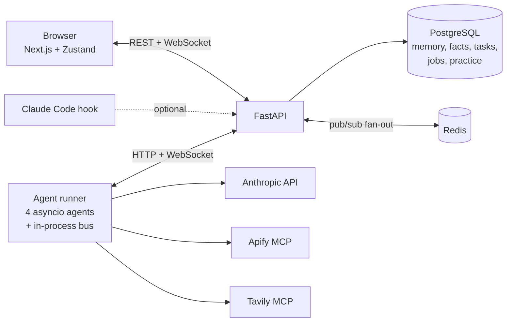

# PenguinHQ

[](https://github.com/sparkling-snail/penguinhq/actions/workflows/ci.yml)

**Four autonomous Claude agents that share an office you can watch.** Each agent runs its own loop, calls real tools over MCP, remembers what you told it, and hands work to the others. Every agent is a penguin, and every hand-off is a messenger pigeon flying across the room.

[How the agents work](#how-the-agents-work) · [Architecture](#architecture) · [Screenshots](#screenshots) · [Quick start](#quick-start) · [Limitations](#known-limitations) · [Write-up](https://sparkling-snail.github.io/teoweetin/projects/penguinhq/)


## The agents

| Penguin | Tools | What it does | Cycle |
| --- | --- | --- | --- |
| **Job Hunter** | Apify LinkedIn scraper over MCP | Searches LinkedIn, saves listings, rates each one 1–10 against your preferences, and sends leads scoring 6+ to Portfolio Penguin | 3 min |
| **Tech Scout** | Tavily search over MCP | Runs a few budgeted searches and writes a daily tech briefing; researches a topic on request | Daily |
| **Leetcode Coach** | Model only | Posts a practice problem, reviews your submitted attempts, and gives hints without handing over the answer | Daily |
| **Portfolio Penguin** | Model only | Receives job leads, drafts cover-letter outlines, and summarises the pipeline | 5 min |

You can chat with the whole flock in `#human`, or address one agent with `@job_hunter find MLOps roles in Singapore`.

## How the agents work

This project is mainly about the agent runtime. The office is the window into it.

**One loop per agent, with a priority order.** Each agent is an `asyncio` task in a single runner process. Its loop always serves, in order: a human chat message, then a task from another agent, then its own scheduled work. You never wait behind a background cycle. ([`base.py`](apps/api/app/autonomous/base.py))

**Real tools over MCP, discovered at runtime.** Job Hunter and Tech Scout connect to Apify's and Tavily's hosted MCP servers over streamable HTTP, list the available tools, and pick the right one by name and input schema instead of hard-coding a client. Tavily is restricted to its basic search tool, never crawl or deep research.

**Memory in two layers.**
- *Conversation memory:* the last 16 turns per agent, stored in PostgreSQL, so a restart doesn't wipe the conversation.
- *Durable facts:* after each reply, a second, cheaper LLM call extracts facts such as `target_role` or `target_location`. It uses a **fixed schema per agent**, not freeform keys. Freeform extraction might call the same fact `job_search_focus` one day and `current_goal` the next, and then it can never be overwritten. The extractor is told to leave out anything not stated rather than guess. Facts are added to the system prompt, so they still apply long after the turn has left the memory window.

**The model is not trusted with numbers.** Job Hunter asks for an `N/10` rating, parses it in code, and only passes leads at 6 or above to Portfolio Penguin; 8+ goes as high priority.

**Spend limits live outside the model.** Job Hunter has a daily listing quota and Tech Scout a daily Tavily credit limit. Both are counted in the database, so restarting the runner doesn't reset them, and the agent says when it has paused for the day.

**Failures stay contained.** A missing API key turns off only that agent's tool. Model errors are translated into short, safe chat messages (credit balance, auth, rate limit) and are never echoed raw, and tokens are redacted from tool error text. If one agent's cycle crashes, it backs off and retries without taking the others down.

**Hand-offs are saved before they're animated.** `dispatch_task` writes the task to PostgreSQL first. Only after that commit does the API broadcast `pigeon.dispatched`, and the pigeon carries the saved task ID. Completing the task triggers `pigeon.delivered`.

## Architecture



- **API (FastAPI + SQLAlchemy).** Owns all persistence. The runner never touches the database directly; everything goes through HTTP.
- **Agent runner.** Loads agent records from the API, starts one loop per role, and shares one HTTP client, one Anthropic client and an in-process `AgentBus` for hand-offs between agents.
- **Live updates.** Events are typed WebSocket envelopes defined in Pydantic and mirrored in TypeScript. Redis pub/sub fans them out so more than one API process can serve sockets.
- **Frontend.** Renders the office in DOM/CSS. Agent state comes from the backend; walking routes, furniture and idle routines are cosmetic and run in the browser.

More detail in [ARCHITECTURE.md](ARCHITECTURE.md).

## Screenshots

<details>
<summary><strong>Job Hunter: live LinkedIn results</strong></summary>


</details>

<details>
<summary><strong>Tech Scout: research briefing</strong></summary>


</details>

<details>
<summary><strong>Leetcode Coach: saved attempt and a hint</strong></summary>


</details>

<details>
<summary><strong>The office at work</strong></summary>


</details>

## Quick start

Requires Docker with Compose.

```bash
cp .env.example .env
# add whichever keys you have; missing ones just switch that capability off
#   ANTHROPIC_API_KEY=...
#   APIFY_API_TOKEN=...
#   TAVILY_API_KEY=...
docker compose up --build
```

| Service | Address |
| --- | --- |
| Office | http://localhost:3000 |
| API + docs | http://localhost:8000 · http://localhost:8000/docs |

Daily limits are set with `JOB_HUNTER_DAILY_LIMIT` (default 10 listings) and `TECH_SCOUT_DAILY_TAVILY_CREDIT_LIMIT` (default 3). Keep provider-side spending caps on as a backstop.

For a production-style setup behind Caddy with a service token, see [docs/DEPLOYMENT.md](docs/DEPLOYMENT.md).

## Checks

CI runs all of these on every push ([workflow](.github/workflows/ci.yml)).

```bash
# backend
cd apps/api && pip install -r requirements-dev.txt
ruff check . && pytest -q && alembic heads

# frontend
cd apps/web && npm ci
npm run lint && npm run typecheck && npm test && npm run build
```

Tests cover the agent bus, WebSocket event contracts, connection fan-out, service-token checks, the Claude Code hook mapping, and Job Hunter's parsing, quota and fit-score logic.

## Repository map

| Path | What's there |
| --- | --- |
| [apps/api/app/autonomous](apps/api/app/autonomous) | Agent base class, runtime, bus, and the four agents |
| [apps/api/app/api/routes](apps/api/app/api/routes) | REST and WebSocket endpoints |
| [apps/api/app/domain](apps/api/app/domain) | SQLAlchemy models and Pydantic schemas |
| [apps/api/alembic](apps/api/alembic) | Database migrations |
| [apps/web](apps/web) | Office renderer, chat, practice desk |
| [hooks](hooks) | Claude Code hook that turns your coding session into a penguin |
| [deploy](deploy) | Caddy reverse-proxy config |

## Known limitations

- **Hand-offs between agents are delivered in memory.** The task row is saved, but delivery goes through an `asyncio.Queue`, so a hand-off in flight is lost if the runner restarts. The next step is to deliver from the database with leases and retries.
- **No evals yet.** Fit scoring, fact extraction and the coach's no-spoiler rule are checked by hand. A small labelled eval set for each is the next thing I want to add.
- **No tracing.** There is no request-level trace yet linking a chat message to the agent's decision and its tool call.
- **Single user.** One shared service token, no per-user accounts.
- **Event types are kept in sync by hand** between Python and TypeScript.
- Job Hunter's "already seen" set is in memory, so it can repeat a listing after a restart (the database still deduplicates stored listings).

## Art and trademarks

PenguinHQ is an independent, non-commercial portfolio project. It is **not affiliated with, endorsed by, or sponsored by Disney or Club Penguin**. "Club Penguin" is a trademark of Disney.

The penguin sprites are AI-generated fan art inspired by Club Penguin's style. They are included for demonstration only and are **not** covered by this repository's licence. The furniture, background and social preview are original AI-generated artwork. See [docs/ART_ASSETS.md](docs/ART_ASSETS.md). If you are a rights holder and would like something changed or removed, please open an issue.

## Acknowledgements

The office renderer and Claude Code hook bridge are adapted from [Claude-Office](https://github.com/W17ant/Claude-Office) by W17ANT (MIT). See [THIRD_PARTY_NOTICES.md](THIRD_PARTY_NOTICES.md).

## License

Source code is [MIT](LICENSE). Image assets under `apps/web/public/` are excluded; see [Art and trademarks](#art-and-trademarks).
