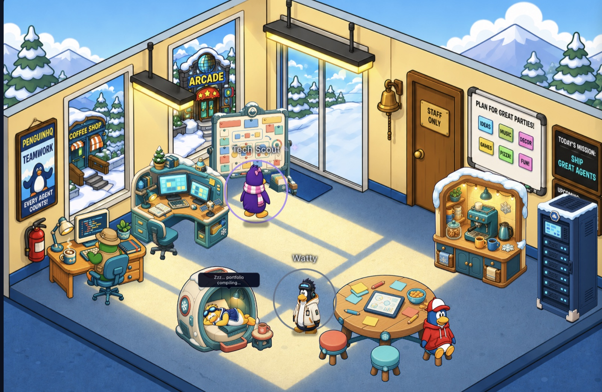
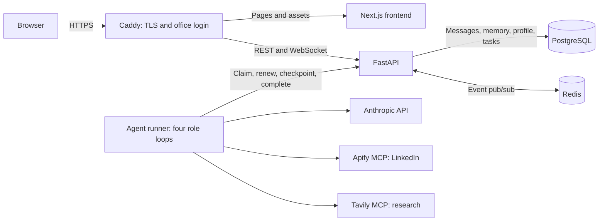
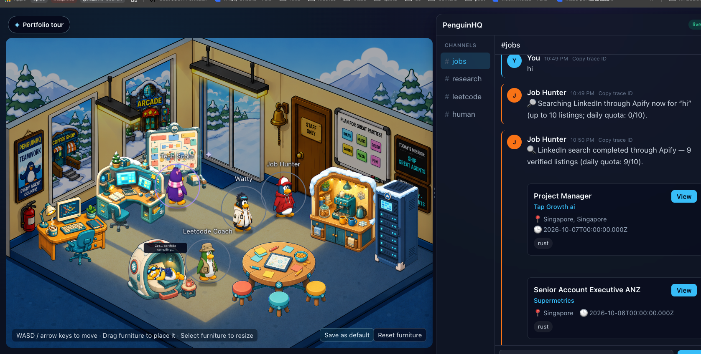
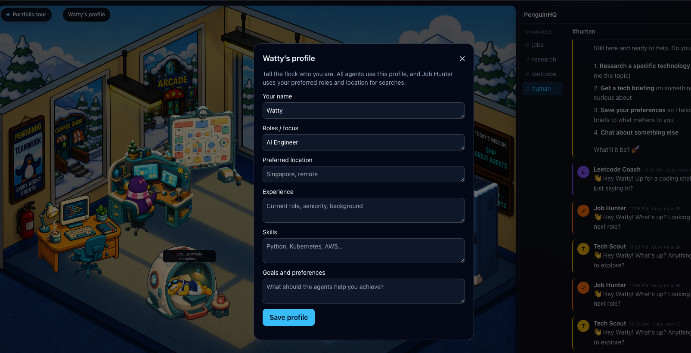
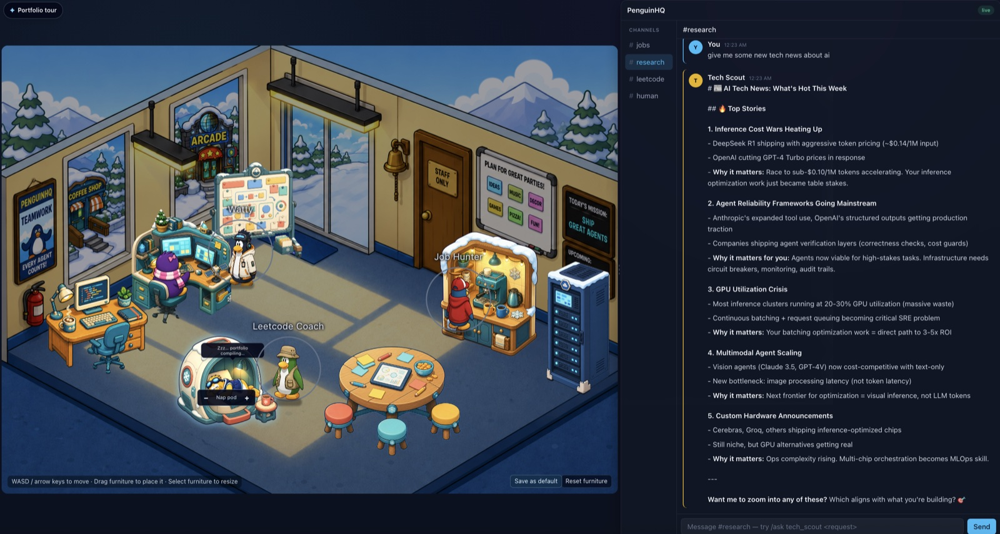
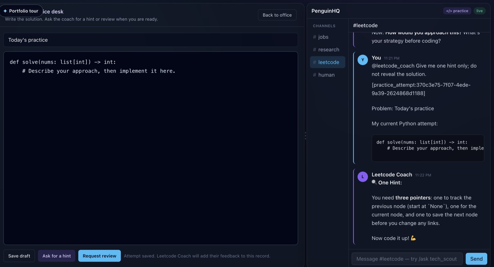
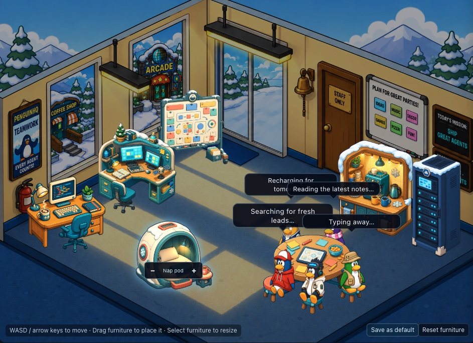
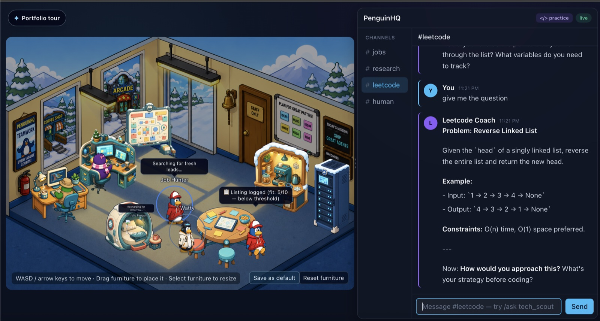
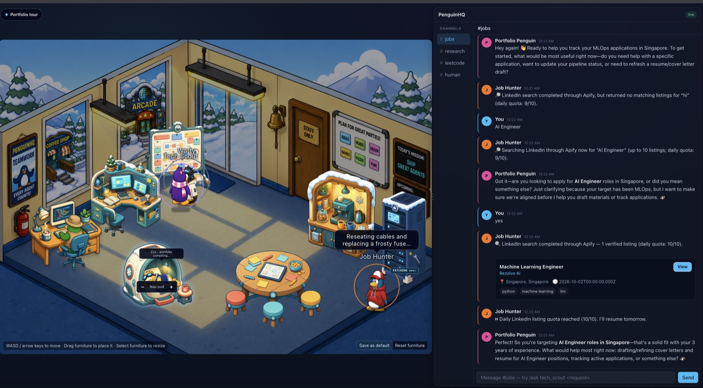

# PenguinHQ

[](https://github.com/sparkling-snail/penguinhq/actions/workflows/ci.yml)

**A multi-agent AI workspace you can watch.** Four specialized penguins help with job searches, technology research, interview practice, and applications. Chat with the flock, save your profile, and watch agents hand work to one another through messenger pigeons.

[Open the public demo](https://penguinhq.vercel.app/) · [Architecture](#architecture) · [Demonstrations](#demo) · [Quick start](#quick-start) · [Case study](docs/CASE_STUDY.md)



> **Two experiences:** the public demo is a deterministic, read-only showcase. The authenticated live office runs real agents and stores its data in PostgreSQL. Scheduled autonomous work is opt-in in the live runtime; cosmetic office movement does not mean an agent is making paid calls.
>
> **Source publication status:** the demonstrations and architecture describe the private live deployment. Its latest application changes are awaiting source publication, so the published checkout does not yet reproduce every live feature.

## What you can do

| Penguin | Role | What it helps with |
| --- | --- | --- |
| Job Hunter | `job_hunter` | Search LinkedIn through Apify, save listings, evaluate fit, and pass leads to Portfolio. |
| Tech Scout | `tech_scout` | Research technology through Tavily and produce source-grounded briefings. |
| Leetcode Coach | `leetcode_coach` | Offer coding problems, hints, and feedback on saved practice attempts. |
| Portfolio Penguin | `portfolio` | Track leads and help prepare application materials. |

In the live office, **Watty’s profile** gives every agent shared background. Try “What is my profile?” to inspect it, “Find jobs” to search using your saved role, or “Search for SRE roles” for a specific search. Ordinary conversation does not authorize an Apify search.

## Architecture

The system has three application processes: a Next.js frontend, a FastAPI API, and a Python agent runner. **PostgreSQL owns durable data and queued work. Redis distributes live notifications.** The runner accesses persistence through the API.



### One message, from chat to reply

1. The browser sends a message with a stable ID. The API saves the message, receiving agents’ memory entries, and their queued tasks in one transaction.
2. The runner claims a task through the API with a renewable lease. Work remains in PostgreSQL across restarts.
3. The agent reads profile and conversation context, decides how to respond, and calls a model or tool when needed. Profile reads can return directly from saved fields.
4. The agent saves its reply and checkpoints through the API, then acknowledges completion. Redis and WebSocket notifications update the office; reconnecting browsers reload persisted history.

| Concern | Implementation in the live runtime |
| --- | --- |
| Recovery | Renewable task leases, bounded retries, saved checkpoints, and stable mutation IDs. |
| Memory | Full conversation turns, per-agent facts, rolling summaries, and retrieval of older turns. |
| Shared identity | One database-backed Watty profile, available to all four agents. |
| Tracing | OpenTelemetry context follows message ingestion, task delivery, agent execution, and HTTP tool calls. Chat exposes a trace ID. Trace export is optional. |
| Office depth | Client-side furniture footprints, A* routes, feet-based drawing order, and interaction docking points. |
| Cost control | Opt-in scheduled cycles, configurable worker concurrency, provider quotas, and explicit job-search intent. |

External calls use **at-least-once execution**: a crash after a provider call but before its checkpoint can repeat that call. Database persistence does not guarantee exactly-once provider billing.

See [the architecture reference](ARCHITECTURE.md) for the sequence diagram, data model, endpoints, deployment boundaries, and recovery details.

## Demo

**[Open the read-only portfolio demo →](https://penguinhq.vercel.app/)**

The screenshots below demonstrate the private full runtime, locally or on its authenticated AWS deployment. Expand a workflow to view it.

<details>
<summary><strong>Job Hunter: real search results</strong></summary>



An explicit search request runs the Apify LinkedIn collector and returns verified listing cards. Requests to view saved results read the database.

</details>

<details>
<summary><strong>Watty’s shared profile</strong></summary>



Save your name, target roles, location, experience, skills, and goals. All four agents use this shared profile; Job Hunter uses the role and location as search defaults. Profile questions display saved fields without starting a search.

</details>

<details>
<summary><strong>Tech Scout: research briefing</strong></summary>



Tech Scout combines Tavily search results with model synthesis to explain current technology topics.

</details>

<details>
<summary><strong>Leetcode Coach: saved attempts and feedback</strong></summary>



The practice desk keeps editable drafts separate from submitted attempts. The coach returns hints and feedback without revealing a complete solution unless asked.

</details>

<details>
<summary><strong>Office meetings and depth</strong></summary>



The flock approaches its meeting positions, uses the three available stools, and shares a gentle bob. Rear attendees appear behind the table. Furniture footprints and pathfinding keep normal walking off tables and pods.

</details>

<details>
<summary><strong>Live office and agent routines</strong></summary>



Agent work state drives the office view. Idle routines, furniture interactions, and proximity greetings make the space interactive.

</details>

<details>
<summary><strong>Role-specific routines</strong></summary>



Tech Scout works at the research station, Portfolio Penguin rests in the pod, and Job Hunter visits the server rack. These cosmetic activities do not by themselves start model or tool calls.

</details>

## Quick start

Use Docker with Docker Compose for local development. Copy the example configuration:

```bash
cp .env.example .env
```

Add the provider credentials needed for your chosen capabilities:

```dotenv
ANTHROPIC_API_KEY=your_key
APIFY_API_TOKEN=your_token
TAVILY_API_KEY=your_key
```

```bash
docker compose up --build
```

| Service | Local address |
| --- | --- |
| Web application | http://localhost:3000 |
| API and interactive docs | http://localhost:8000 · http://localhost:8000/docs |
| PostgreSQL | localhost:5432 |
| Redis | localhost:6379 |

The development containers mount source files for hot reload. Missing provider credentials leave the corresponding model/search capability unavailable. See [.env.example](.env.example) for configuration; provider-side spending limits remain the billing backstop.

For host development, use Node.js 20 and Python 3.12, start PostgreSQL and Redis with Compose, and configure locally reachable service URLs. Backend dependencies are in `apps/api/requirements-dev.txt`; frontend scripts are in `apps/web/package.json`.

## Deployment modes

| Mode | Purpose | Access and behavior |
| --- | --- | --- |
| Local development | Build and test the full stack | Development ports and hot reload. |
| Public portfolio | Let visitors explore the office | Demo data with `NEXT_PUBLIC_DEMO_MODE=true`; no live user mutations or provider calls. |
| Private live office | Run the agents for one owner | HTTPS and office login at Caddy; the API, worker, PostgreSQL, and Redis use an internal network. |

The private live deployment uses a single AWS Lightsail host with persistent database storage. Its budget configuration limits agent concurrency to one and leaves scheduled cycles off. Provider API usage is separate from hosting. Database backups and restore checks are required for recovery beyond container restarts; a backup on the same disk does not protect against losing that disk.

For the published public topology, start with [.env.production.example](.env.production.example) and follow [the deployment guide](docs/DEPLOYMENT.md). See [architecture: deployment and access](ARCHITECTURE.md#deployment-and-access) for the live topology and its single-owner boundary. Never put provider keys or service tokens in frontend environment variables.

## Development and checks

**Stack:** Next.js · React · TypeScript · Zustand · Tailwind CSS · FastAPI · SQLAlchemy · PostgreSQL · Redis · Anthropic · MCP · Docker Compose.

Backend:

```bash
cd apps/api
pip install -r requirements-dev.txt
ruff check .
pytest -q
alembic heads
```

Frontend:

```bash
cd apps/web
npm ci
npm run lint
npm run typecheck
npm test
npm run build
```

The live implementation also has PostgreSQL integration tests for task recovery, idempotent delivery, and profile persistence. They require an isolated database whose name ends in `_test`; never point destructive fixtures at an application database. [GitHub Actions](.github/workflows/ci.yml) defines the checks for the published revision.

Health endpoints: `GET /health` checks liveness; `GET /health/ready` checks PostgreSQL and reports Redis connectivity. Production data routes require authentication.

### Repository map

| Path | Responsibility |
| --- | --- |
| [apps/web](apps/web) | Office renderer, profile form, chat, practice desk, and browser state. |
| [apps/api/app/api/routes](apps/api/app/api/routes) | HTTP/WebSocket transport and persistence operations. |
| [apps/api/app/autonomous](apps/api/app/autonomous) | Worker runtime, shared agent behavior, and four specialists. |
| [apps/api/app/domain](apps/api/app/domain) | Database models, request schemas, and work ownership rules. |
| [apps/api/alembic](apps/api/alembic) | Versioned database migrations. |
| [hooks](hooks) | Claude Code activity bridge. |
| [deploy](deploy) | Reverse proxy and deployment support. |
| [docs](docs) | Guides, demonstrations, engineering notes, and artwork provenance. |

## Boundaries and next steps

- The live office supports one owner. Shared browser credentials and service tokens do not provide per-user data isolation.
- PostgreSQL persistence survives process/container restarts when its volume is retained; disk loss requires an independent backup.
- Provider calls can repeat after failures. Workflow changes must preserve checkpoint compatibility or drain existing work.
- Shared profile fields are user-edited; inferred facts remain agent-scoped. Conversation summaries are context aids, not replacements for raw saved turns.
- Search relevance and availability depend on external providers. Operational quotas are not guaranteed billing caps.
- Event contracts still need manual synchronization between Python and TypeScript.
- Furniture movement is a 2D approximation. Tightly overlapping custom layouts can block seats, and penguins can pass through one another.

## Documentation

| Guide | Read it for |
| --- | --- |
| [Architecture](ARCHITECTURE.md) | Components, message flow, persistence, tracing, and deployment boundaries. |
| [Case study](docs/CASE_STUDY.md) | Engineering motivation and design trade-offs. |
| [Deployment](docs/DEPLOYMENT.md) | Published public-demo setup and operational workflow. |
| [Security](SECURITY.md) | Service authentication, secret handling, and reporting vulnerabilities. |
| [Demo script](docs/DEMO_SCRIPT.md) | A short walkthrough and recording checklist. |
| [Art assets](docs/ART_ASSETS.md) | Asset provenance and visual-identity considerations. |

## Art and trademarks

PenguinHQ is an independent, non-commercial portfolio project. It is **not affiliated with, endorsed by, or sponsored by Disney or Club Penguin**. "Club Penguin" is a trademark of Disney.

The penguin character sprites are AI-generated fan art inspired by the style of Club Penguin. They are included for demonstration only and are **not** covered by this repository's license. The office furniture, background, and social preview are original AI-generated artwork. See [`docs/ART_ASSETS.md`](docs/ART_ASSETS.md) for provenance guidance and the original-character replacement plan. If you are a rights holder and would like something changed or removed, please open an issue.

## Acknowledgements

The office renderer and Claude Code hook bridge are adapted from [Claude-Office](https://github.com/W17ant/Claude-Office) by W17ANT (MIT). See [THIRD_PARTY_NOTICES.md](THIRD_PARTY_NOTICES.md).

## License

The source code is released under the [MIT License](LICENSE). Image assets under `apps/web/public/` are excluded — see [Art and trademarks](#art-and-trademarks).
